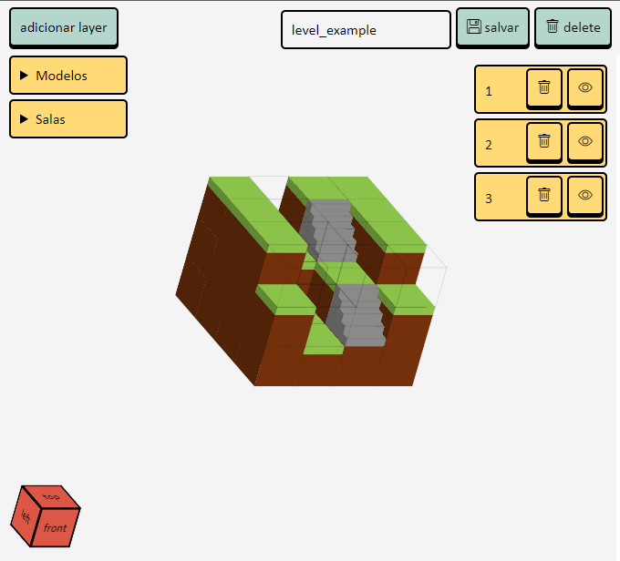

# MAP EDITOR

by: [@v.ii.n.i](https://instagram.com/v.ii.n.i)

Projeto feito para complementar a criação de design levels em conjunto com o [3d editor](https://github.com/gitviini/3d_editor).

### Features
#### ADD
* Permite selecionar criar novas layers e seus tamanhos, sendo adicionada acima ou abaixo das camadas antes feitas.
#### PREVIEW CREATE¹
* Ao clicar num bloco ele será trocado pelo modelo antes selecionado;
#### ORIENTATION CUBE
* Cubo de orientação (frente, trás, topo e etc.).
#### ACTIONS
* Salvar room e selecionar o piso³;
* Deletar room;
#### OPTIONS
* Ícone de trash/lixo: deleta a camada;
* Ícone de magic_eye/olho mágico: (des)oculta a camada;
#### MODELOS
* Ao selecionar um modelo ele é definido como padrão²;
#### SALAS
* Coloca a sala selecionada no Preview Create;
#### BOTÕES (modo mobile)
* D-pad para movimentar o Preview create¹.
#### Banco de dados (MariaDB)
COMANDOS:
* create database game;
* use game;
* create table rooms(
	name VARCHAR(20) PRIMARY KEY NOT NULL,
    map TEXT NOT NULL,
	commands TEXT,
    floor VARCHAR(20) NOT NULL
);
* pronto 😎

¹: Visualização do mapa (centro da tela);
²: É utilizado como bloco padrão para novas camadas adicionadas;
³: Camada onde o personagem começará o jogo.