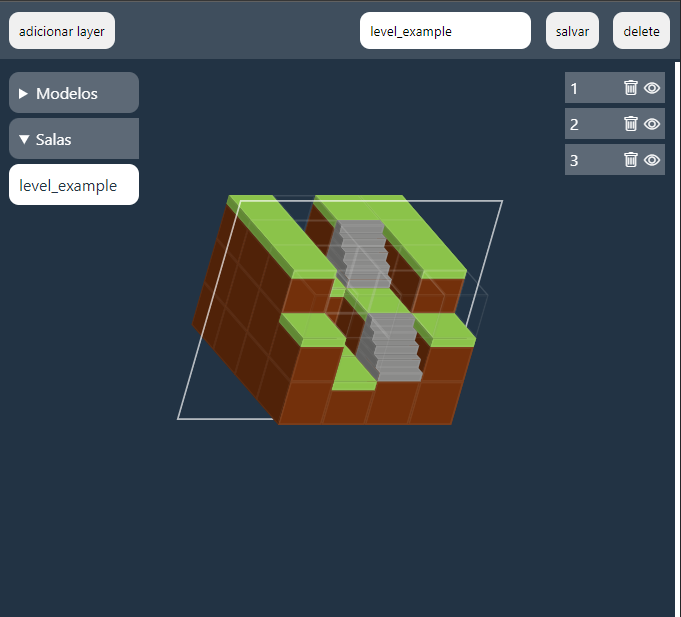

# MAP EDITOR

by: [@v.ii.n.i](https://instagram.com/v.ii.n.i)

Projeto feito para complementar a criação de design levels em conjunto com o [3d editor](https://github.com/gitviini/3d_editor).

### Features
#### PREVIEW CREATE¹
* Ao clicar num bloco ele será trocado pelo modelo antes selecionado;
#### OPTIONS
* Ícone de trash/lixo: deleta a camada;
* Ícone de magic_eye/olho mágico: (des)oculta a camada;
#### MODELOS
* Ao selecionar um modelo ele é definido como padrão²;
#### ROOMS
* Coloca a sala selecionada no Preview Create;

¹: Visualização do mapa (centro da tela);
²: É utilizado como bloco padrão para novas camadas adicionadas.